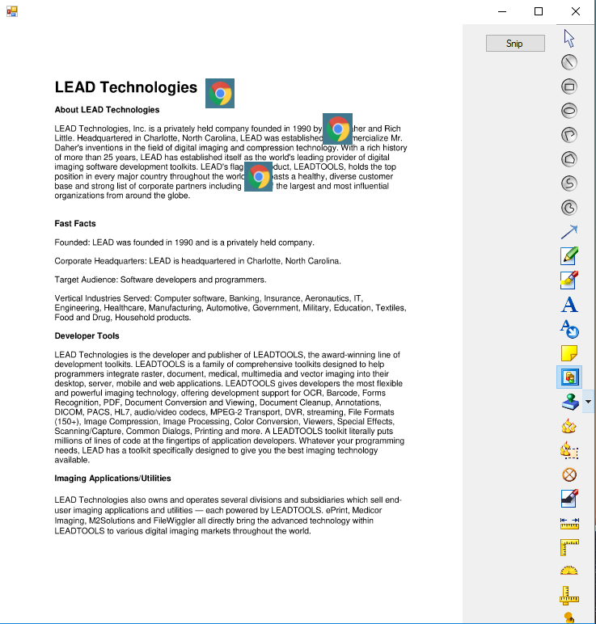

# LTCustomAnnotation
.NET Framework Winforms application using LEADTOOLS Annotations SDK.

The following project utilizes the LEADTOOLS Annotations libraries to enable users to screencap a specific portion of the screen and use the image as the annotation on the opened document. Within the screenshot below, the custom annotation was that of the Google Chrome logo taken from the desktop. More information can be found at the link below:

Leadtools Annotations SDK:
https://www.leadtools.com/sdk/annotation

#Note: must have LEADTOOLS libraries to run

